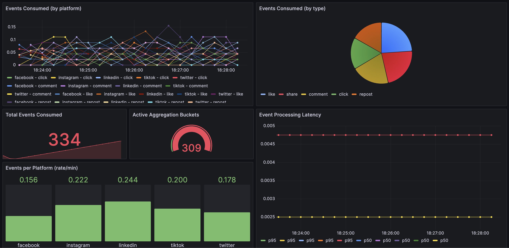

# Social Analytics Pipeline

A Go backend project that demonstrates event-driven architecture with Kafka, time-window aggregation, REST APIs, and observability with Prometheus + Grafana.

## Architecture

```
┌──────────────┐     ┌───────────┐     ┌──────────────┐     ┌──────────┐
│   Producer   │────▶│   Kafka   │────▶│   Consumer   │────▶│  Store   │
│  (simulator) │     │  (topic)  │     │ + Aggregator │     │ (in-mem) │
└──────────────┘     └───────────┘     └──────┬───────┘     └────┬─────┘
                                              │                  │
                                              ▼                  ▼
                                         ┌──────────┐        ┌──────────┐
                                         │Prometheus│        │ REST API │
                                         └─────┬────┘        └──────────┘
                                               ▼
                                         ┌──────────┐
                                         │ Grafana  │
                                         └──────────┘
```

**Producer** Generates simulated social media engagement events (likes, shares, clicks, comments, reposts) across multiple platforms and publishes them to a Kafka topic.

**Consumer** Reads events from Kafka, aggregates them into 1-minute time windows per post/platform, and exposes both a query API and Prometheus metrics.

## Grafana Dashboard



## Tech Stack

- **Go 1.22** — backend language
- **Apache Kafka** — event streaming (via `segmentio/kafka-go`)
- **Prometheus** — metrics collection
- **Grafana** — dashboards and visualization
- **Docker Compose** — local orchestration

## Quick Start

### Prerequisites
- Docker and Docker Compose

### Run Everything

```bash
docker compose up --build
```

This starts:
| Service    | URL                     |
|------------|-------------------------|
| Kafka      | `localhost:9092`        |
| API        | `http://localhost:8080` |
| Prometheus | `http://localhost:9090` |
| Grafana    | `http://localhost:3000` (admin/admin) |

### Run Tests

```bash
go test ./...
```

## API Endpoints

### `GET /health`
Health check.

### `GET /metrics/all`
Returns all aggregated time-window buckets.

### `GET /metrics/query`
Query with filters:

| Param      | Description                        | Example                          |
|------------|------------------------------------|----------------------------------|
| `post_id`  | Filter by post ID                  | `post_id=post-1`                |
| `platform` | Filter by platform                 | `platform=twitter`              |
| `from`     | Start of time range (RFC3339)      | `from=2025-01-01T12:00:00Z`    |
| `to`       | End of time range (RFC3339)        | `to=2025-01-01T13:00:00Z`      |

Example:
```bash
curl "http://localhost:8080/metrics/query?platform=twitter&post_id=post-1"
```

### `GET /prometheus`
Prometheus metrics endpoint.

## Prometheus Metrics

| Metric | Type | Labels | Description |
|--------|------|--------|-------------|
| `analytics_events_consumed_total` | Counter | `platform`, `event_type` | Events consumed from Kafka |
| `analytics_events_produced_total` | Counter | — | Events produced to Kafka |
| `analytics_event_processing_seconds` | Histogram | `event_type` | Event processing latency |
| `analytics_active_buckets` | Gauge | — | Active aggregation buckets |

## Project Structure

```
├── cmd/
│   ├── consumer/    # Main service: Kafka consumer + API + metrics
│   ├── producer/    # Event simulator
│   └── api/         # Standalone API server (dev mode, no Kafka)
├── api/             # HTTP handler and routes
├── internal/
│   ├── models/      # Domain types (events, metrics)
│   ├── kafka/       # Kafka consumer and producer
│   ├── aggregator/  # Time-window aggregation logic
│   ├── store/       # In-memory metrics store
│   └── metrics/     # Prometheus instrumentation
├── configs/         # Prometheus and Grafana configs
├── docker-compose.yml
├── Dockerfile
└── README.md
```

## Environment Variables

| Variable | Default | Description |
|----------|---------|-------------|
| `KAFKA_BROKER` | `localhost:9092` | Kafka broker address |
| `KAFKA_TOPIC` | `engagement-events` | Kafka topic name |
| `KAFKA_GROUP_ID` | `analytics-consumer` | Consumer group ID |
| `API_ADDR` | `:8080` | API listen address |
